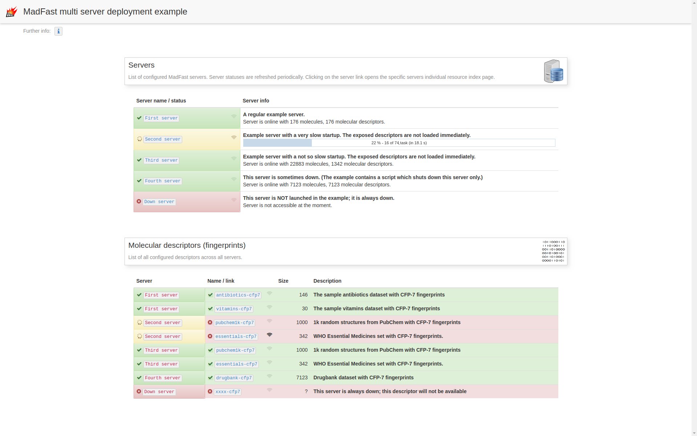

Connecting to multiple MadFast servers example
==============================================

This is a MadFast UI customization example for a simple UI side dashboard.

Requirements
------------

  - Linux
  - Java 8 (we recommend [Adopt OpenJDK](https://adoptopenjdk.net/))
  - MadFast 0.3.5 distribution (see <https://disco.chemaxon.com/products/madfast/latest/>) downloaded
  - Licenses acquired and set (see <https://disco.chemaxon.com/products/madfast/latest/doc/getting-started-guide.html>)

Getting started
---------------

  - Make sure that the MadFast distribution is available at `./madfast-cli-0.3.5/`.
  - Run `prepare.sh`
  - Run `start.sh`
  - Open `http://localhost:18085/additional/index.html` from a browser.
  - Try to stop one (`stop-server-4.sh`) or all (`stop.sh`) servers or restart them using `start.sh`.

Change configured servers
-------------------------

Configuration is described in `additional/data/servers-info.json`. The servers are accessed at
`http://localhost:<PORT>`; make sure the addresses are set up properly.

